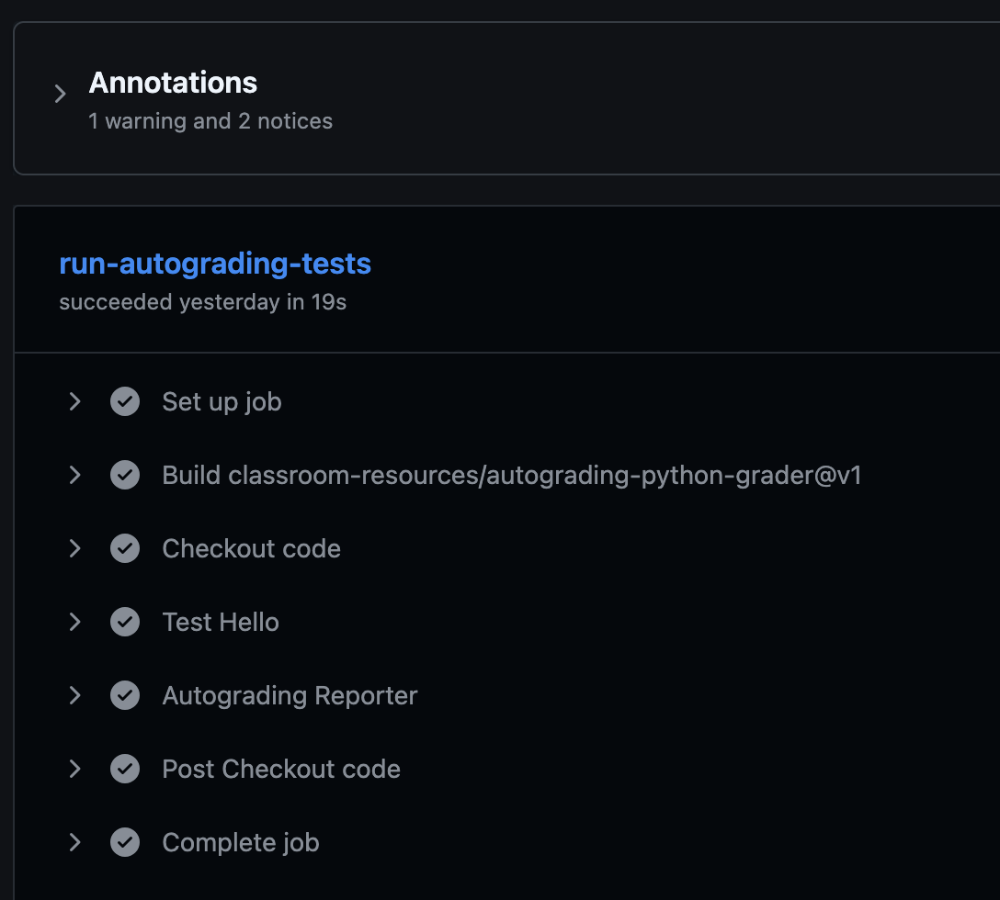

# Introduction

Welcome to **Intro to Python**. This book teaches Python **without** building terminal **text-mode UI** apps: we do **not** use **Textual**, **Rich**, or similar console UI libraries.

The **first** part of the course is **core Python**: syntax, control flow, modules, **automated testing with pytest**, and **Pydantic** / JSON. **HTTP**, **FastAPI**, **Uvicorn**, and **HTTPX** are saved for the **final** chapters, after **virtual environments** and dependency setup—so the web stack comes last.

Your work lives in a **GitHub Classroom** repository created from a **base template**. The book gives **theory**, **directions**, and **code samples**; you **implement** in that template and **push** for review.

**Grading:** Assignments are checked in part by an **autograder** on GitHub Classroom that runs **`pytest`**. You will learn to run **`pytest` locally** early on; the **official** tests live on the grader side.

> [!WARNING]
>
> **Do not push your own tests**  
> Practice tests stay **local**. The autograder supplies tests that you do not need to modify. **Never commit or push** personal **`test_*.py`** files you wrote for practice, **`.pytest_cache/`**, or **`__pycache__`** unless your instructor explicitly tells you otherwise. See [Testing with Pytest](./testing_with_pytest.md) for more details.

> [!IMPORTANT]
>
> **GitHub Classroom**
>
> 1. Open **[Accept the GitHub Classroom assignment](https://classroom.github.com/a/f2frF2Rk)**.
> 2. Sign in to GitHub, **accept** the assignment, and wait for your **personal repository**.
> 3. Complete any **email / invitation** steps your course requires.
> 4. **Clone** your repo and open the project in your editor. (**Virtual environments** are covered near the **end**, right before the web chapters.)

> [!NOTE]
>
> **One template, whole series**  
> Pay attention to various assignments listed in this book as some will have you clone additional class repos.

> [!TIP]
>
> **Submit after each milestone**  
> When you finish a chapter’s exercises, **commit** with a clear message and **push** to **`main`** (or the branch your instructor uses).

> [!WARNING]
>
> **Feedback pull request**  
> If your repo has a **Feedback** PR for instructor comments, **do not merge or close it**. Keep working on **`main`** and pushing; treat that PR as a discussion thread only.

## Capstone preview

There will be a capstone project that will come at the end and here is a small preview of that project. 

The **final project** is a **Python web server** (FastAPI + Uvicorn) that exposes a custom route:

- **Path:** `GET /ping`
- **Response body (JSON):** `{"message": "pong"}`

The path through the book is: **basics → pytest mindset → more Python → Pydantic/JSON → venv & packages → HTTP client → FastAPI → Uvicorn → capstone**.

## What you need

- **Python 3.12+** (match your template’s `requires-python` if it specifies one).
- **Git** and a code editor.
- A terminal to run **`python`**, **`pip`**, and later **`pytest`** and **`uvicorn`**.

## Your Turn
The code that you cloned for your first assigment is prepped with some boiler plate code. There are code comments in `hello.py` the direct you what to do.

Make your edits and commit/push your code back up to your provided repo.

## Results

Once you push your code, an automated test will run and score your assignment. To see the details, you can click on the Actions tab for your repo. Here is what that could look like.



Expand the Autograding Reporter to see the finer details and your score.

```
🔄 Processing: test-hello
✅ test main prints hello world - line 4
Test code:
    """Check that main() prints exactly 'Hello, World!'"""
    
    # Run the student's main function
    hello.main()
    
    # Capture everything that was printed
    captured = capsys.readouterr()
    
    # Clean up the output (remove extra spaces/newlines)
    output = captured.out.strip()
    expected = "Just write 175 lines of Python"
    
    # Use pytest.fail() instead of assert → no ugly diff at the bottom!
    if output != expected:
        pytest.fail(f"Expected exactly this: {expected} But your main() printed: \
{output}")

Total points for test-hello: 50.00/50

Test runner summary
┌────────────────────┬─────────────┬─────────────┐
│ Test Runner Name   │ Test Score  │ Max Score   │
├────────────────────┼─────────────┼─────────────┤
│ test-hello         │ 50          │ 50          │
├────────────────────┼─────────────┼─────────────┤
│ Total:             │ 50          │ 50          │
└────────────────────┴─────────────┴─────────────┘
🏆 Grand total tests passed: 1/1

Notice: Points 50/50
Notice: {"totalPoints":50,"maxPoints":50}
```